[](https://github.com/khushi2704rj-sephora/Antigravity/actions/workflows/railway.yml)

<div align="center">

# 🌌 Antigravity: The Game Theory Lab

[](https://react.dev/)
[](https://fastapi.tiangolo.com/)
[](https://www.docker.com/)
[](https://scipy.org/)
[](LICENSE)

**A modern, interactive simulation platform for visualizing Game Theory concepts, Nash Equilibria, and Multi-Agent dynamics.**

[🚀 **Live Demo**](https://antigravity.railway.app) · [📖 **API Documentation**](https://antigravity.railway.app/docs)

---

[🎯 Overview](#-project-overview) · [🎲 Simulations](#-simulations-catalog) · [🏗️ Architecture](#️-system-architecture) · [📂 Structure](#-repository-structure) · [🚀 Quick Start](#-quick-start) · [🤝 Contributing](#-contributing)

</div>

---

## 🎲 Simulations Catalog

All **22 interactive simulations** organized by category:

| Category | Simulation | Description |
|---|---|---|
| **🎯 Classic Games** | Prisoner's Dilemma | The foundational cooperation vs. defection dilemma |
| | Stag Hunt | Coordination game exploring risk-dominant vs. payoff-dominant equilibria |
| | Battle of the Sexes | Coordination with conflicting preferences |
| | Matching Pennies | Zero-sum game with mixed strategy equilibria |
| | Rock Paper Scissors | Extended RPS with evolutionary dynamics |
| **💰 Economic Models** | Cournot-Bertrand | Oligopoly competition: quantity vs. price setting |
| | Stackelberg | Leader-follower sequential competition |
| | Market Entry | Entry deterrence and accommodation strategies |
| | Auction Mechanisms | First-price, second-price, and all-pay auction formats |
| | Supply Chain | Multi-tier supply chain coordination games |
| **🤝 Negotiation & Social** | Ultimatum Game | Fair division and rejection thresholds |
| | Public Goods | Free-rider problem and contribution dynamics |
| | Centipede Game | Backward induction vs. cooperative behavior |
| | War of Attrition | Persistence and escalation in conflict scenarios |
| | Multi-Agent Negotiation | N-player bargaining with coalition dynamics |
| **🧠 Advanced Theory** | Bayesian Signaling | Information asymmetry and strategic signaling |
| | Coalition Formation | Shapley values and cooperative game theory |
| | Reputation & Trust | Repeated games with reputation building |
| | Network Contagion | Strategy spread through network topologies |
| | Evolutionary Stable Strategies | Population dynamics and ESS analysis |
| | Coordination (General) | Generalized coordination with multiple equilibria |
| | Colonel Blotto | Resource allocation across multiple battlefields |

---

## 🎯 Project Overview

**Antigravity** bridges the gap between abstract mathematical models and intuitive understanding. Built with a high-performance **FastAPI** backend and a **React 19** frontend, it allows researchers and students to simulate complex game-theoretic scenarios in real-time.

**Key Features:**
- **22 Simulations**: From classic dilemmas to advanced multi-agent systems.
- **Nash Solver**: Real-time calculation of pure and mixed strategy equilibria using `Nashpy`.
- **Interactive Visuals**: Dynamic payoff matrices and evolution graphs using `Plotly.js`.
- **Material Design 3**: A polished, Google-inspired UI with glassmorphism effects.
- **Dockerized Deployment**: One-command setup with `docker-compose`.

---

## 🏗️ System Architecture

The application follows a decoupled microservices architecture, containerized with Docker for seamless deployment.

```mermaid
graph TD
    User[👤 User / Browser] -->|HTTPS| Nginx[🌐 Nginx Reverse Proxy]
    
    subgraph "Docker Network"
        Nginx -->|/api/*| API[⚡ FastAPI Backend]
        Nginx -->|/*| Client[⚛️ React Frontend]
        
        API -->|Computation| SciPy[🧮 SciPy / Nashpy Solver]
        API -->|Data Handling| NumPy[Pandas / NumPy]
    end
    
    style User fill:#fff,stroke:#333
    style Nginx fill:#009639,stroke:#006400,color:#fff
    style API fill:#009688,stroke:#004d40,color:#fff
    style Client fill:#61DAFB,stroke:#0d47a1,color:#000
    style SciPy fill:#8CAAE6,stroke:#1a237e,color:#fff
```



---

## 📂 Repository Structure

```
antigravity/
│
├── backend/                  ← Python Service
│   ├── app/
│   │   ├── main.py           ← API Entrypoint & Routes
│   │   ├── simulations/      ← Game Logic Modules
│   │   └── solver.py         ← Nash Equilibrium Algorithms
│   ├── Dockerfile
│   └── requirements.txt
│
├── frontend/                 ← TypeScript React App
│   ├── src/
│   │   ├── components/       ← Creating Reusable UI
│   │   ├── stores/           ← State Management
│   │   └── App.tsx
│   ├── Dockerfile
│   └── package.json
│
├── docker-compose.yml        ← Orchestration Config
├── LICENSE                   ← MIT License
└── README.md                 ← Project Documentation
```

---

## 🚀 Quick Start

### Option 1: Docker (Recommended)

Run the entire stack with a single command:

```bash
# Clone the repository
git clone https://github.com/khushi2704rj-sephora/Antigravity.git
cd Antigravity

# Start services
docker-compose up --build
```

Access the app at `http://localhost:3000` and the API docs at `http://localhost:8000/docs`.

### Option 2: Manual Setup

**Backend:**
```bash
cd backend
python -m venv venv
source venv/bin/activate
pip install -r requirements.txt
uvicorn app.main:app --reload
```

**Frontend:**
```bash
cd frontend
npm install
npm run dev
```

---

## 🤝 Contributing

We welcome contributions! Whether it's adding a new game simulation, optimizing the solver, or polishing the UI. 

Please see [CONTRIBUTING.md](CONTRIBUTING.md) for details.

---

<div align="center">

### 👩‍💻 Author

**Khushi Kothari**

[](https://github.com/khushi2704rj-sephora)
[](https://www.linkedin.com/in/khushi-kothari--/)
[](mailto:khushi2704.ak@gmail.com)

*MSc Business Analytics · Game Theory & Strategic Decision-Making*

</div>